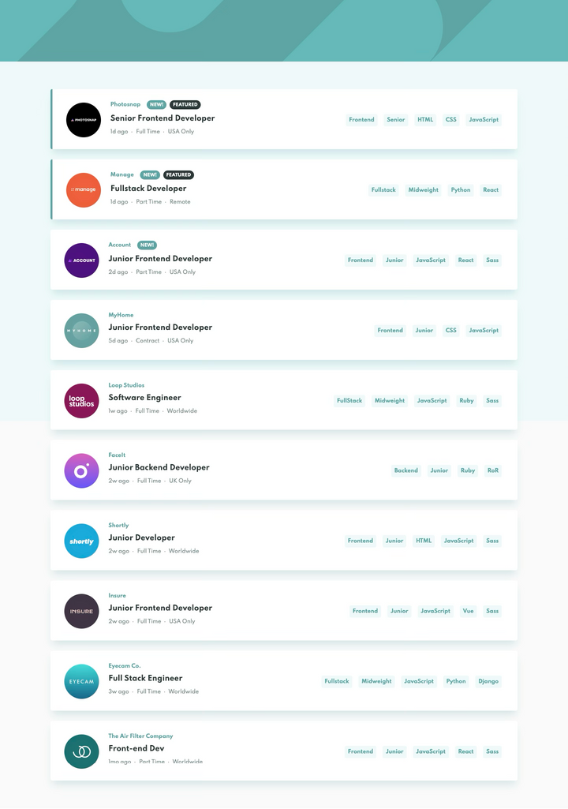
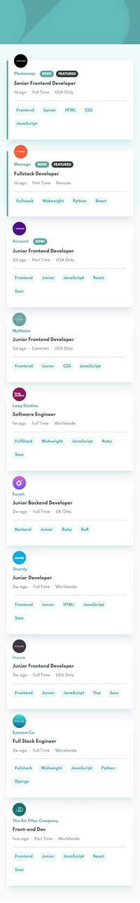

# 💼 Job Listings with Filtering

An interactive job board built with Vue 3 and TypeScript. Users can filter listings based on selected tags, such as role, level, tools, and languages, all with dynamic UI updates.

🔗 **Live Demo**: [http://devjobs-app-five.vercel.app/](http://devjobs-app-five.vercel.app/)

---

## 🧱 Tech Stack

- Vue 3 + Vite  
- TypeScript  
- Composition API (`<script setup>`)  
- SCSS for styling

---

## 📱 Responsive Previews

| Desktop                     | Tablet                     | Mobile                     |
|----------------------------|----------------------------|---------------------------|
|     |      |      |

---

## ✨ Features

- Filter jobs by role, level, tools, and languages
- Responsive layout for mobile, tablet, and desktop
- Clean and modern UI
- Built with TypeScript and Vue 3 Composition API

---

## 🛠️ Project Setup

```bash
yarn install
yarn dev
```

### Build for Production

```bash
yarn build
```
